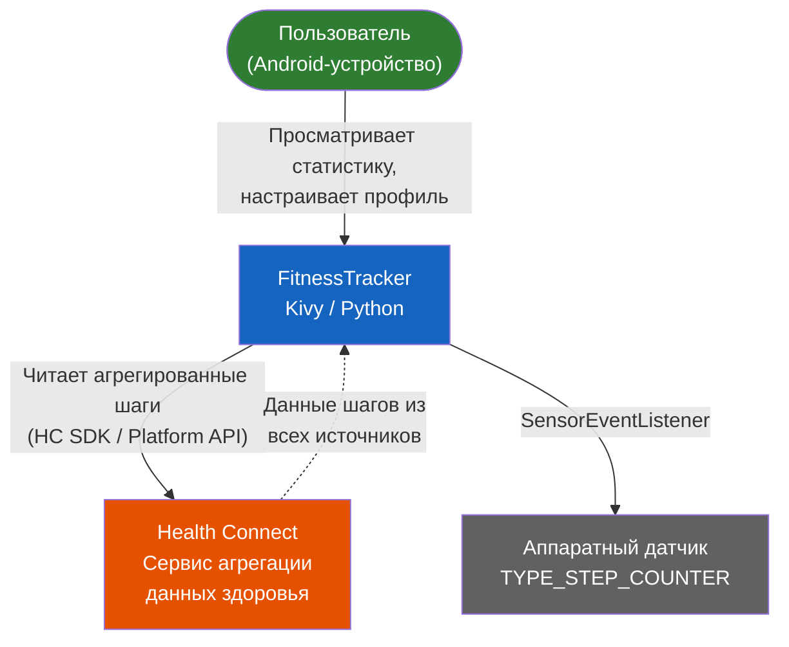
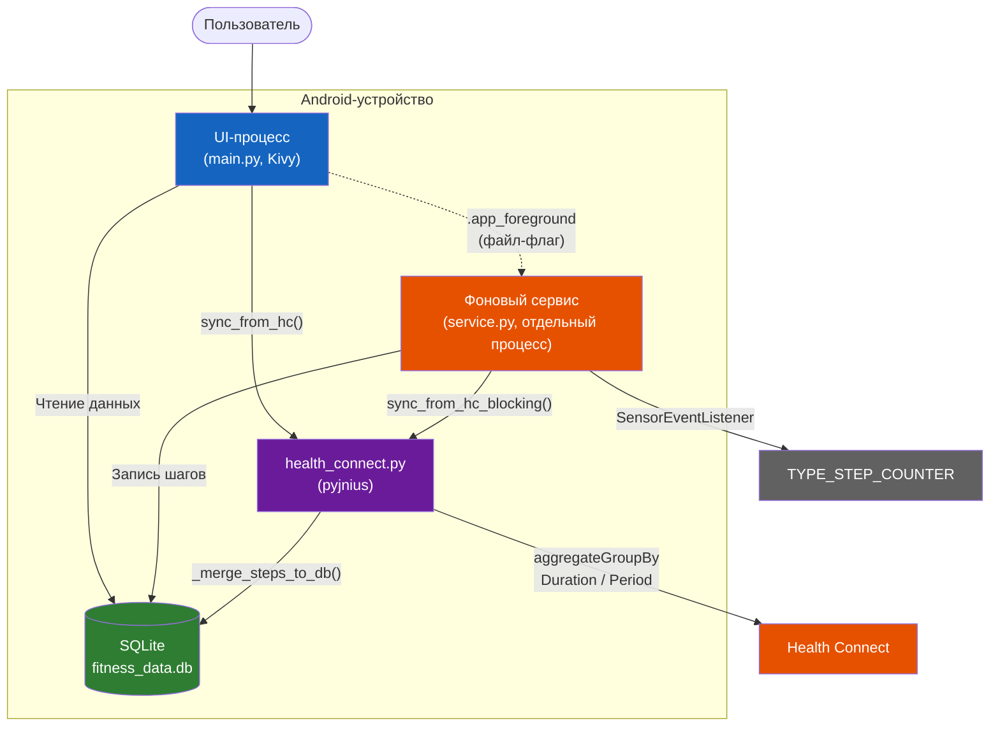
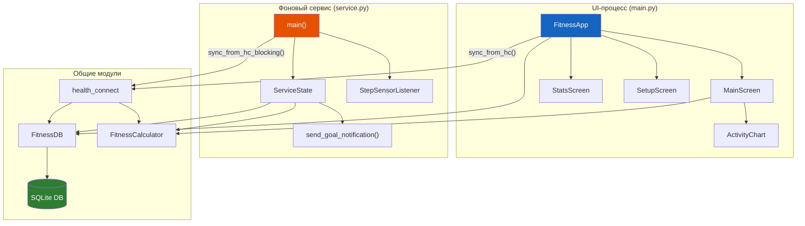
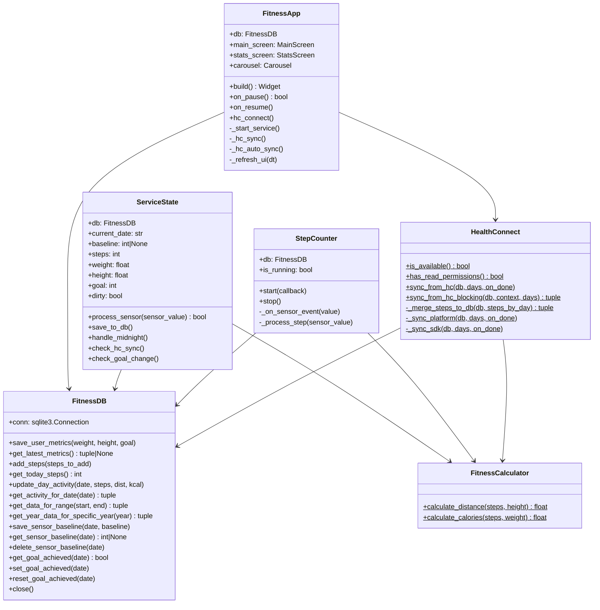
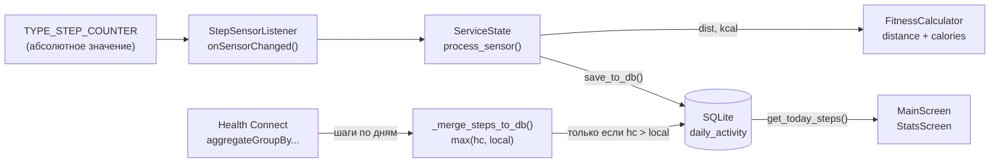
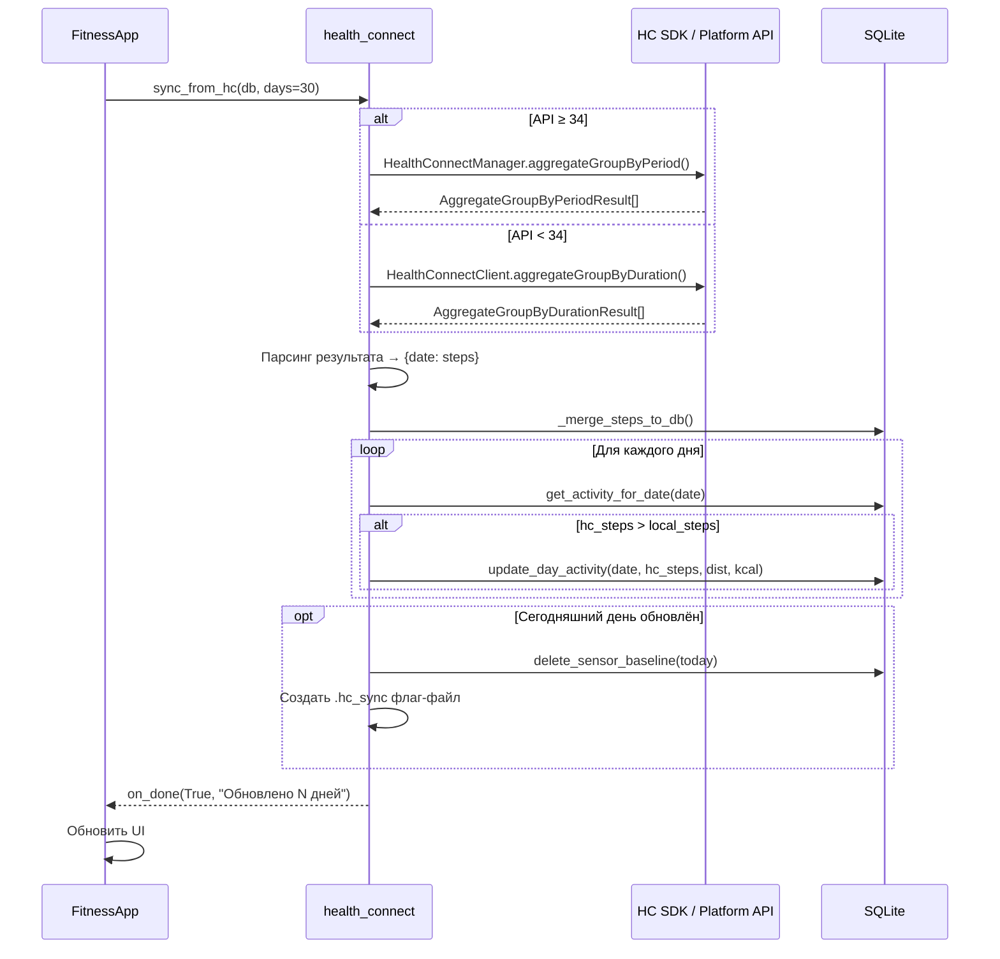
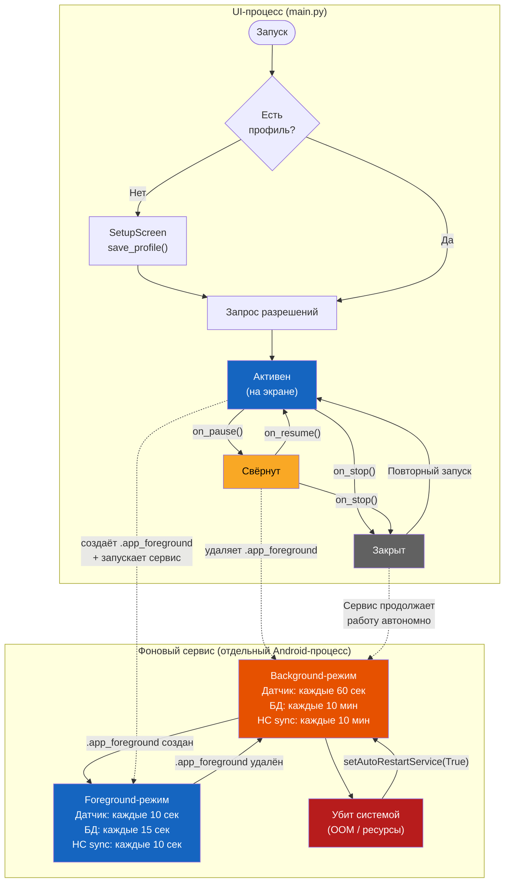
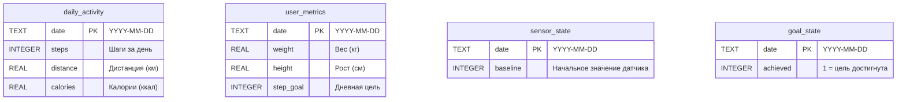

# FitnessTracker

**Студент:** Ражина Маргарита Александровна
**Группа:** 220032-11
**Курсовая работа:** Фитнес-трекер с интеграцией датчиков устройства
  
Python + Kivy + HealthConnect
Мобильное приложение для мониторинга физической активности: подсчёт шагов, дистанции, калорий/ Интеграция с HealthConnect, графики прогресса, push-уведомления о достижении целей.
---

## Оглавление

- [Возможности](#возможности)
- [Архитектура](#архитектура)
  - [C4 — контекст системы](#c4--контекст-системы)
  - [C4 — контейнеры](#c4--контейнеры)
  - [Диаграмма компонентов](#диаграмма-компонентов)
  - [Диаграмма классов](#диаграмма-классов)
  - [Поток данных шагов](#поток-данных-шагов)
  - [Последовательность синхронизации HC](#последовательность-синхронизации-hc)
  - [Жизненный цикл приложения](#жизненный-цикл-приложения)
  - [Схема базы данных](#схема-базы-данных)
- [API модулей](#api-модулей)
- [Структура проекта](#структура-проекта)
- [Сборка и запуск](#сборка-и-запуск)
  - [Docker Compose](#docker-compose)
  - [Docker (ручной запуск)](#docker-ручной-запуск)
- [Тестирование](#тестирование)
- [Отладка на устройстве](#отладка-на-устройстве)
- [Безопасность](#безопасность)

---

## Возможности

- Подсчёт шагов через аппаратный датчик `TYPE_STEP_COUNTER`
- Фоновый сервис (`foreground service`) — работает при свёрнутом/закрытом приложении
- Интеграция с **Health Connect** (API 26–34+) — чтение шагов из других приложений
- Расчёт дистанции и калорий на основе роста и веса
- Графики активности (неделя / месяц / год)
- Push-уведомление при достижении дневной цели
- Автоматический перезапуск сервиса при убийстве процесса

---

## Архитектура

### C4 — контекст системы



### C4 — контейнеры



### Диаграмма компонентов



### Диаграмма классов



### Поток данных шагов



### Последовательность синхронизации HC



### Жизненный цикл приложения

> **Сервис работает в отдельном Android-процессе** (`android:process=":service_Stepservice"`).
> Даже если приложение полностью закрыто (`on_stop`), сервис продолжает считать шаги
> и отправлять push-уведомления. При убийстве процесса системой —
> `setAutoRestartService(True)` автоматически перезапускает сервис.



### Схема базы данных



---

## API модулей

### `calculator.py` — FitnessCalculator

| Метод | Параметры | Возвращает | Описание |
|-------|-----------|------------|----------|
| `calculate_distance` | `steps: int, height: float` | `float` | Дистанция в км. Длина шага = `(рост_м / 4) + 0.37` |
| `calculate_calories` | `steps: int, weight: float` | `float` | Калории в ккал. Коэф. `0.000477 ккал/шаг/кг` |

### `database.py` — FitnessDB

| Метод | Параметры | Возвращает | Описание |
|-------|-----------|------------|----------|
| `save_user_metrics` | `weight, height, goal` | — | Сохраняет/обновляет профиль на текущую дату |
| `get_latest_metrics` | — | `(weight, height, goal)` или `None` | Последние параметры пользователя |
| `add_steps` | `steps_to_add: int` | — | Добавляет шаги к текущему дню (инкремент) |
| `get_today_steps` | — | `int` | Шаги за сегодня |
| `update_day_activity` | `date, steps, distance, calories` | — | Абсолютная перезапись данных за день |
| `get_activity_for_date` | `date_str` | `(steps, dist, kcal)` | Данные за конкретную дату |
| `get_data_for_range` | `start_date, end_date` | `(labels, data_dict)` | Данные за диапазон дат |
| `get_year_data_for_specific_year` | `year: int` | `(labels, data_dict)` | Суммы по месяцам |
| `save_sensor_baseline` | `date, baseline` | — | Baseline датчика на дату |
| `get_sensor_baseline` | `date` | `int` или `None` | Чтение baseline |
| `delete_sensor_baseline` | `date` | — | Удаление baseline (пересчёт) |
| `get_goal_achieved` | `date` | `bool` | Цель достигнута сегодня? |
| `set_goal_achieved` | `date` | — | Отметить цель достигнутой |
| `reset_goal_achieved` | `date` | — | Сбросить флаг (при смене цели) |

### `health_connect.py`

| Функция | Параметры | Возвращает | Описание |
|---------|-----------|------------|----------|
| `is_available()` | — | `bool` | HC доступен на устройстве |
| `has_read_permissions()` | — | `bool` | Все HC-разрешения выданы |
| `sync_from_hc` | `db, days, on_done` | — | Асинхронная синхронизация (UI-поток) |
| `sync_from_hc_blocking` | `db, context, days` | `(bool, str)` | Блокирующая синхронизация (из сервиса) |
| `_merge_steps_to_db` | `db, steps_by_day` | `(merged, total)` | Слияние: пишет только если HC > local |

**Двухпутевая архитектура HC:**

| API Level | Метод | TimeRange | Группировка |
|-----------|-------|-----------|-------------|
| ≥ 34 | `HealthConnectManager.aggregateGroupByPeriod()` | `LocalTimeRangeFilter` + `LocalDateTime` | `Period.ofDays(1)` |
| < 34 | `HealthConnectClient.aggregateGroupByDuration()` | `TimeRangeFilter.between(Instant, Instant)` | `Duration.ofDays(1)` |

### `service.py` — ServiceState

| Метод | Параметры | Возвращает | Описание |
|-------|-----------|------------|----------|
| `process_sensor` | `sensor_value: int` | `bool` | Обрабатывает значение датчика. `True` = шаги изменились |
| `save_to_db` | — | — | Записывает данные в БД (если dirty). Защита от перезаписи HC |
| `handle_midnight` | — | — | Смена дня: сохранение + сброс |
| `check_hc_sync` | — | — | Проверка файл-флага `.hc_sync` |
| `check_goal_change` | — | — | Перечитает цель из БД, сбрасывает уведомление |

**Интервалы сервиса:**

| Параметр | Foreground | Background |
|----------|-----------|------------|
| Проверка датчика | 10 сек | 60 сек |
| Запись в БД | 15 сек | 10 мин |
| HC-синхронизация | 10 сек (из main.py) | 10 мин |

### `step_counter.py` — StepCounter

| Метод | Описание |
|-------|----------|
| `start(callback)` | Регистрирует `SensorEventListener` на `TYPE_STEP_COUNTER` |
| `stop()` | Снимает регистрацию датчика |

### `widgets.py` — UI-компоненты

| Класс | Описание |
|-------|----------|
| `SetupScreen` | Экран первичной настройки профиля (рост, вес, цель) |
| `MainScreen` | Главный экран: шаги, дистанция, калории, прогресс-кольцо |
| `StatsScreen` | Графики активности: неделя / месяц / год |
| `ActivityChart` | Canvas-виджет столбчатой диаграммы с тач-интерактивностью |
| `SettingsPopup` | Popup редактирования профиля |

---

## Структура проекта

```
project/
├── main.py                 # Точка входа Kivy-приложения (UI-процесс)
├── service.py              # Фоновый сервис подсчёта шагов (отдельный процесс)
├── database.py             # SQLite: таблицы, CRUD-операции
├── calculator.py           # Расчёт дистанции и калорий
├── health_connect.py       # Интеграция с Health Connect (SDK + Platform API)
├── step_counter.py         # Обёртка датчика TYPE_STEP_COUNTER для UI-процесса
├── widgets.py              # Kivy-виджеты: экраны, графики, popup'ы
├── fitness.kv              # Kivy Language разметка интерфейса
├── fill_test_data.py       # Скрипт генерации тестовых данных
├── buildozer.spec          # Конфигурация сборки Android APK
│
├── Dockerfile              # Docker-образ на базе kivy/buildozer
├── docker-compose.yml      # Сервисы: build (APK) и test (pytest)
├── .dockerignore           # Исключения для Docker build context
│
├── patches/                # Патчи шаблонов python-for-android
│   ├── AndroidManifest.tmpl.xml   # + HC intent-filters, foregroundServiceType
│   └── build.tmpl.gradle          # + kotlin-stdlib exclusion
│
├── scripts/
│   ├── apply_patches.sh    # Применяет патчи к p4a шаблонам
│   └── entrypoint.sh       # Точка входа Docker: скачивание → патчи → сборка
│
├── tests/
│   ├── conftest.py         # Фикстуры, моки Android-модулей
│   ├── test_calculator.py  # 11 тестов FitnessCalculator
│   ├── test_database.py    # 22 теста FitnessDB
│   ├── test_health_connect.py  # 9 тестов HC (stubs + merge)
│   ├── test_service_state.py   # 13 тестов ServiceState
│   └── test_integration.py     # 12 интеграционных тестов
│
├── images/                 # Иконка приложения, splash screen
└── bin/                    # Собранные APK (генерируется buildozer)
```

---

## Сборка и запуск

### Docker Compose

**Сборка APK:**

```powershell
docker compose run --rm build
```

- Первый запуск: скачивает Android SDK, NDK, python-for-android (~20–30 мин)
- Автоматически применяет патчи Health Connect (intent-filters, kotlin exclusion)
- Кэш сохраняется в Docker volume `buildozer-cache` — повторные сборки быстрее
- APK появляется в `bin/`

**Тесты в контейнере:**

```powershell
docker compose run --rm test
```

### Docker (ручной запуск)

Если не нужен Compose, можно запустить buildozer напрямую через официальный образ:

```powershell
docker run -it --rm `
    -v buildozer-cache:/home/user/.buildozer `
    -v ${PWD}:/home/user/hostcwd `
    -e BUILDOZER_ALLOW_ROOT=1 `
    kivy/buildozer android debug
```

> **Важно:** при первом запуске buildozer скачает SDK/NDK/p4a. Сборка может
> упасть с ошибкой `Kotlin duplicate classes`. После этого нужно применить патчи:

```bash
# Внутри контейнера или через docker exec:
bash scripts/apply_patches.sh

# Затем повторная сборка:
buildozer android debug
```

Docker Compose автоматизирует эти шаги через `scripts/entrypoint.sh`.

### Установка APK на устройство

```powershell
# Список подключённых устройств
.\adb.exe devices

# Установка APK
.\adb.exe install -r bin\fitnesstracker-0.1.7-arm64-v8a_armeabi-v7a-debug.apk
```

---

## Тестирование

```bash
# Запуск всех тестов
python -m pytest tests/ -v

# С покрытием
python -m pytest tests/ --cov=. --cov-report=term-missing

# В Docker
docker compose run --rm test
```

**66 тестов** (11 calculator + 22 database + 9 health_connect + 13 service_state + 12 integration).

Покрытие тестируемых модулей:

| Модуль | Покрытие | Комментарий |
|--------|----------|-------------|
| `calculator.py` | 100% | Полное |
| `database.py` | 98% | Все CRUD-операции |
| `service.py` (ServiceState) | 46% | Логика без Android-зависимостей. Остальное — Java-классы |
| `health_connect.py` | 21% | Десктопные stubs + merge-логика. HC SDK требует устройство |

---

## Отладка на устройстве

### Просмотр логов (logcat)

Все логи приложения выводятся с тегом `python`. Для фильтрации:

```powershell
.\adb.exe logcat python:D *:S
```

- `python:D` — все сообщения уровня DEBUG и выше от Python-кода
- `*:S` — подавление всех остальных тегов Android

**Полезные теги в логах:**

| Тег логгера | Модуль | Описание |
|-------------|--------|----------|
| `FitnessTracker` | main.py | Запуск, разрешения, UI |
| `FitnessTracker.Service` | service.py | Фоновый сервис, датчик |
| `FitnessTracker.Database` | database.py | Операции с БД |
| `FitnessTracker.HealthConnect` | health_connect.py | Синхронизация HC |
| `FitnessTracker.StepCounter` | step_counter.py | Датчик в UI-процессе |
| `FitnessTracker.UI` | widgets.py | Обновление интерфейса |

### Извлечение базы данных

```powershell
.\adb.exe shell run-as org.test.fitnesstracker cat files/app/fitness_data.db > fitness_data.db
```

---

## Безопасность

### SAST (Bandit)

Статический анализ: **0 High, 0 Medium, 8 Low** (из 2095 строк):

| ID | Файл | Описание | Оценка |
|----|------|----------|--------|
| B311 ×2 | `fill_test_data.py` | `random.randint()` | Не криптооперация — допустимо |
| B110 ×6 | `health_connect.py`, `main.py` | `try/except/pass` | Намеренное подавление некритичных ошибок |

### SCA (зависимости)

| Пакет | Версия | CVE |
|-------|--------|-----|
| Kivy | 2.3.1 | Нет |
| buildozer | 1.5.0 | Нет |
| plyer | via p4a | Нет |
| sqlite3 | stdlib | Нет |
| HC connect-client | 1.0.0-alpha11 | Нет |

### Патчи

Директория `patches/` содержит модифицированные шаблоны p4a, необходимые для работы Health Connect:

| Файл | Изменение | Причина |
|------|-----------|---------|
| `AndroidManifest.tmpl.xml` | HC intent-filters, `foregroundServiceType="health"`, `<queries>` | Регистрация в HC, разрешения API 13+/14+ |
| `build.tmpl.gradle` | `configurations.all { exclude kotlin-stdlib-jdk7/jdk8 }` | Устранение `Duplicate class` при компиляции |
